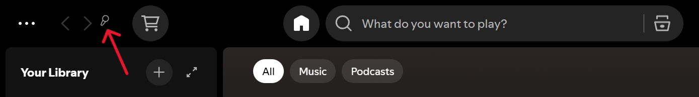

  

# 🟩 Brat Lyrics for Spicetify

Bring the iconic, chaotic, and aesthetic "Brat" vibe straight to your Spotify.

Instead of regular boring lyrics, **Brat Lyrics** transforms your currently playing song into a massive, edge-to-edge, lowercase text block that perfectly captures the viral Brat aesthetic. 

## ✨ Features
* **Authentic Auto-Square Engine:** Automatically scales, squishes, and resizes the font so the lyrics perfectly form an aesthetic, rigid text block.
* **The "Brat" Filter:** Applies the signature slight blur and lowercase-only formatting to all texts.
* **Punctuation Sweeper:** Automatically cleans up annoying parentheses `()` from the lyrics to keep the block looking clean.
* **Real-time Color Customizer:** Click the handy **⚙ (Gear)** icon on the top screen to change the background and text color on the fly to match your mood!

## 🖱️ How to Use
Simply play a song and click the **Brat Lyrics** button located on your Spotify topbar.

## 📥 How to Install

### 1. Using the Spicetify Marketplace (Recommended)
1. Open Spotify and go to the **Marketplace** tab (Shopping cart icon).
2. Click on the **Extensions** tab.
3. Search for **Brat Lyrics**.
4. Click the download/install button.
5. Play a song, click the "Brat Lyrics" button on your topbar, and enjoy!

### 2. Manual Installation (For developers)
1. Make sure you have [Spicetify](https://spicetify.app/) installed.
2. Download the `brat-lyric.js` file from this repository.
3. Put the file inside your Spicetify `Extensions` directory.
4. Open your terminal/command prompt.
5. Run: `spicetify config extensions brat-lyric.js`
6. Run: `spicetify apply`
7. All done!

---
*Created with chaotic energy. Enjoy the aesthetics!*
